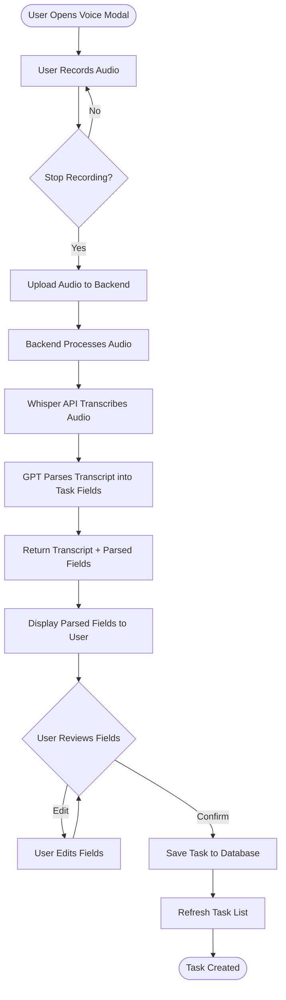
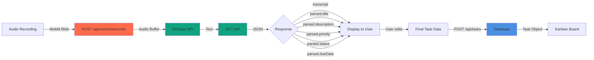

## 1. Project Setup

### Prerequisites

- Node.js v18 or higher
- npm or yarn
- OpenAI API key

### Install Steps

1. Clone the repository
2. Install dependencies for both frontend and backend:
   ```bash
   cd frontend && npm install
   cd ../backend && npm install
   ```

3. Set up environment variables:
   - Create `.env` file in the `backend` directory:
     ```
     OPENAI_API_KEY=your_openai_api_key_here
     PORT=5000
     NODE_ENV=development
     ```

### How to Run Everything Locally

1. Start the backend server:
   ```bash
   cd backend
   npm run dev
   ```
   Server runs on `http://localhost:5000`

2. Start the frontend development server:
   ```bash
   cd frontend
   npm run dev
   ```
   Frontend runs on `http://localhost:5173`

---

## 2. Tech Stack

### Frontend
- **Framework**: React 18 with TypeScript
- **Build Tool**: Vite
- **Styling**: Tailwind CSS
- **Drag & Drop**: @hello-pangea/dnd
- **HTTP Client**: Axios

### Backend
- **Runtime**: Node.js with Express
- **Language**: TypeScript
- **Database**: SQLite with better-sqlite3
- **File Upload**: Multer
- **AI Services**:
  - OpenAI Whisper API (speech-to-text)
  - OpenAI GPT-3.5-turbo (transcript parsing)

### Key Features
- Voice-enabled task creation with AI parsing
- Dual view modes: Kanban board with drag-and-drop AND list view
- Advanced filtering (status, priority, due date range, search)
- Real-time backend status indicator
- Responsive design

---

# 3. API documentation

### Base URL

`http://localhost:5000`

### Health Check

| Method | Endpoint  | Description         | Request Body | Response                                         |
| ------ | --------- | ------------------- | ------------ | ------------------------------------------------ |
| `GET`  | `/health` | Server health check | None         | `{ status: "ok", message: "Server is running" }` |

### Task Endpoints (`/api/tasks`)

| Method   | Endpoint         | Description     | Request Body                                             | Response                          |
| -------- | ---------------- | --------------- | -------------------------------------------------------- | --------------------------------- |
| `GET`    | `/api/tasks`     | Get all tasks   | None                                                     | `{ success: true, data: Task[] }` |
| `GET`    | `/api/tasks/:id` | Get task by ID  | None                                                     | `{ success: true, data: Task }`   |
| `POST`   | `/api/tasks`     | Create new task | `{ title, description?, priority, status, dueDate? }`    | `{ success: true, data: Task }`   |
| `PUT`    | `/api/tasks/:id` | Update task     | `{ title?, description?, priority?, status?, dueDate? }` | `{ success: true, data: Task }`   |
| `DELETE` | `/api/tasks/:id` | Delete task     | None                                                     | `{ success: true }`               |

### Task Object

```typescript
{
  id: string
  title: string
  description?: string
  status: "To Do" | "In Progress" | "Done"
  priority: "Low" | "Medium" | "High" | "Urgent"
  dueDate?: string (ISO datetime)
  createdAt: string (ISO datetime)
  updatedAt: string (ISO datetime)
}
```

### Voice Endpoints (`/api/voice`)

| Method | Endpoint                | Description                          | Request Body                | Response                                                                    |
| ------ | ----------------------- | ------------------------------------ | --------------------------- | --------------------------------------------------------------------------- |
| `POST` | `/api/voice/transcribe` | Transcribe audio + parse task fields | `FormData: { audio: File }` | `{ success: true, data: { transcript: string, parsed: ParsedTaskFields } }` |

### ParsedTaskFields

```typescript
{
  title: string
  description?: string
  priority: "Low" | "Medium" | "High" | "Urgent"
  status: "To Do" | "In Progress" | "Done"
  dueDate?: string (ISO datetime)
}
```

### Notes

- `/api/voice/transcribe` combines audio transcription and parsing in a single efficient API call
- All endpoints return errors in format: `{ success: false, error: string, details?: string }`
- Audio files must be uploaded as multipart/form-data with field name `"audio"`
- Supported audio formats: WebM (browser MediaRecorder output)

---

# 4. Decisions & Assumptions

### Key Design Decisions

1. **Single API Call for Voice Processing**: Combined transcription and parsing into one endpoint (`/api/voice/transcribe`) to reduce network overhead and improve user experience.

2. **User Review Before Save**: Parsed task fields are displayed to the user for review and editing before saving, ensuring accuracy and user control.

3. **OpenAI Services**:
   - Whisper API (`whisper-1`) for reliable speech-to-text transcription
   - GPT-3.5-turbo for intelligent parsing of natural language into structured task fields

4. **SQLite Database**: Lightweight, serverless database perfect for single-user task management without additional setup.

5. **Client-side Audio Recording**: Audio is recorded in the browser using MediaRecorder API, then sent as WebM blob to minimize data transfer.

6. **Filter Architecture**: Implemented with React hooks and useMemo for optimal performance with multiple filter types (search, status, priority, date range).

### Assumptions

- Single-user application (no authentication/authorization)
- Tasks are personal and don't require sharing or collaboration
- OpenAI API key is provided and has sufficient quota
- Modern browser with MediaRecorder API support

### Task Creation Flow



### Data Flow Architecture



---

## 5. AI Tools Usage

### Development Process

Claude Code was extensively used throughout development for:
- Project architecture and system design
- Boilerplate generation for components and API endpoints
- Logic flow optimization and best practices
- Bug identification and resolution
- Code refactoring and improvements

### Key Collaborative Prompts

1. **Architecture Discussion**:
   - "I think audio should be recorded at the user device first and then sent to backend for transcription and parsing. What do you think of this approach? Any suggestions?"
   - Result: Implemented client-side recording with browser MediaRecorder API

2. **API Optimization**:
   - "I think a single api call to transcribe + parse should be made as it is more efficient? User can review the parsed output in the modal and then create task using another call. Suggestion?"
   - Result: Combined transcription and parsing into single `/api/voice/transcribe` endpoint

3. **Feature Implementation**:
   - "Implement filter and search, filter tasks by status, priority, or due date / Search tasks by title or description"
   - Result: Comprehensive filter system with search, multi-select filters, and date range picker

4. **Code Quality**:
   - "Which functions are not used in the codebase?"
   - Result: Identified and removed unused code for cleaner codebase

### OpenAI Integration

- **Whisper API**: Converts voice recordings to text with high accuracy
- **GPT-3.5-turbo**: Parses natural language transcripts into structured task data (title, description, priority, status, due date)

### LLM Parsing Strategy

The system uses a structured prompt to extract task fields:
- Handles relative dates ("tomorrow", "next Monday", "in 3 days")
- Extracts priority keywords ("urgent", "high priority")
- Defaults status to "To Do" unless specified
- Returns null for unparseable fields
- Preserves raw transcript for user reference and editing
