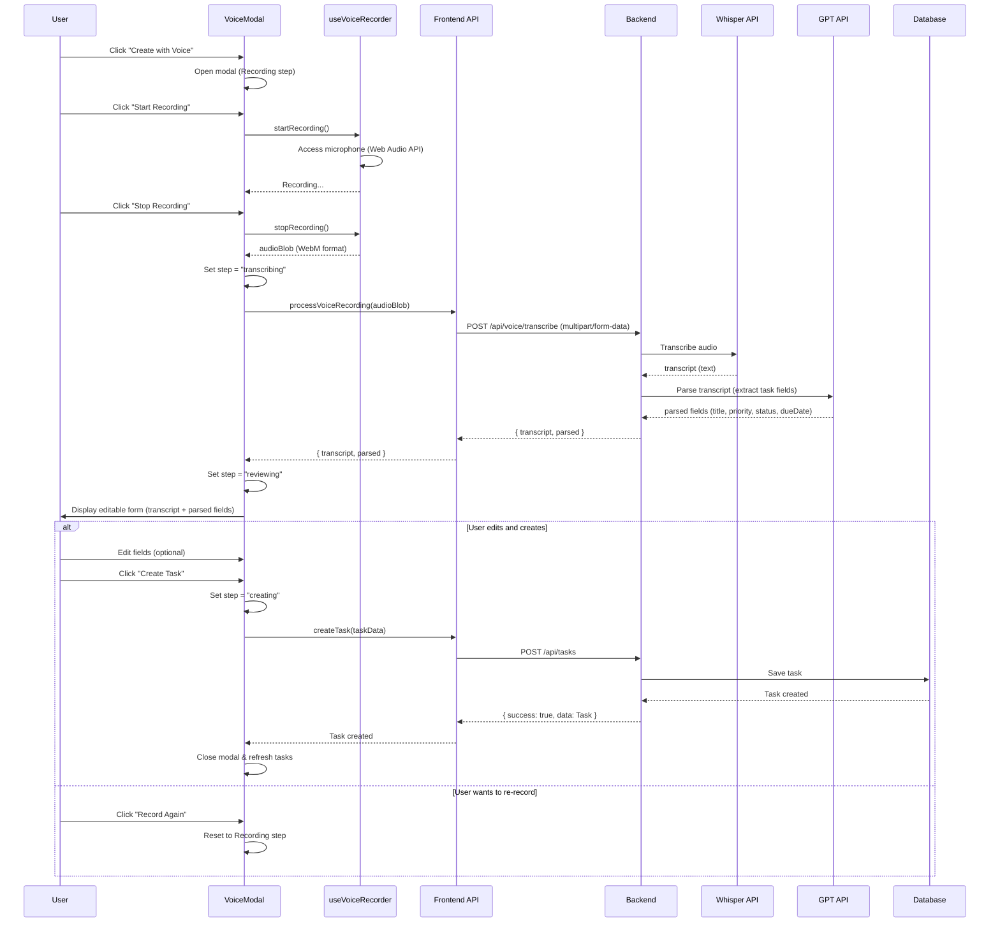
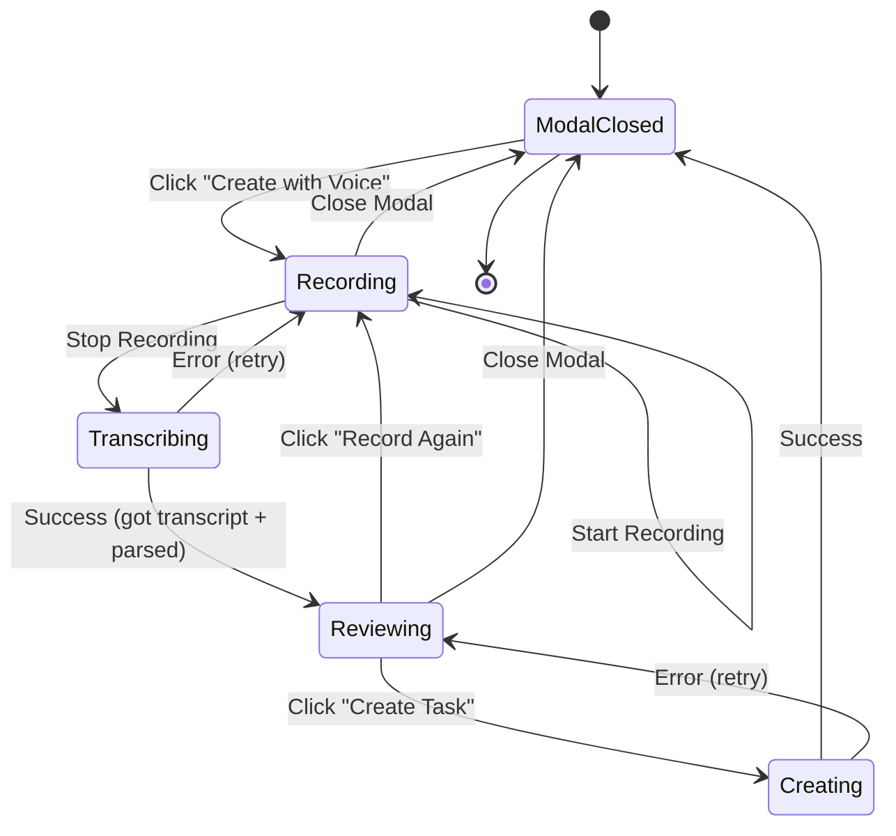
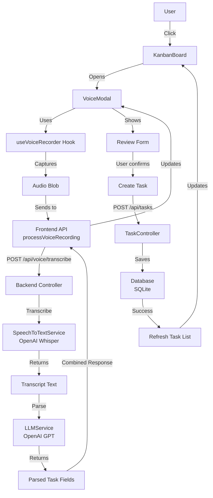
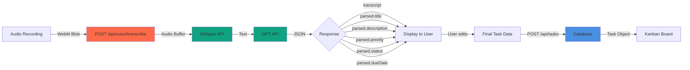
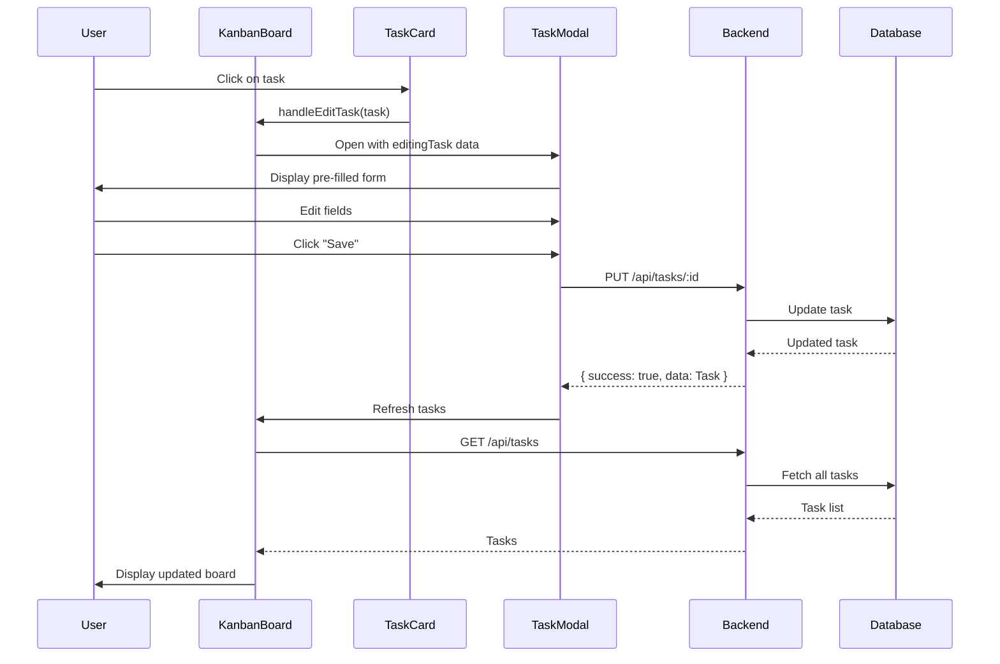

## 1. Project setup

### Prerequisites

- Node version:
- DB:
- ## API keys
  -

### Install steps

### How to run everything locally

---

## 2. Tech Stack

- Frontend: React + Vite + Tailwind CSS
- Backend: Express, SQLite
- AI: Open AI
- Key libraries

---

# 3. API documentation

### Base URL

`http://localhost:5000`

### Health Check

| Method | Endpoint  | Description         | Request Body | Response                                         |
| ------ | --------- | ------------------- | ------------ | ------------------------------------------------ |
| `GET`  | `/health` | Server health check | None         | `{ status: "ok", message: "Server is running" }` |

---

### Task Endpoints (`/api/tasks`)

| Method   | Endpoint         | Description     | Request Body                                             | Response                          |
| -------- | ---------------- | --------------- | -------------------------------------------------------- | --------------------------------- |
| `GET`    | `/api/tasks`     | Get all tasks   | None                                                     | `{ success: true, data: Task[] }` |
| `GET`    | `/api/tasks/:id` | Get task by ID  | None                                                     | `{ success: true, data: Task }`   |
| `POST`   | `/api/tasks`     | Create new task | `{ title, description?, priority, status, dueDate? }`    | `{ success: true, data: Task }`   |
| `PUT`    | `/api/tasks/:id` | Update task     | `{ title?, description?, priority?, status?, dueDate? }` | `{ success: true, data: Task }`   |
| `DELETE` | `/api/tasks/:id` | Delete task     | None                                                     | `{ success: true }`               |

### Task Object

```typescript
{
  id: string
  title: string
  description?: string
  status: "To Do" | "In Progress" | "Done"
  priority: "Low" | "Medium" | "High" | "Urgent"
  dueDate?: string (ISO datetime)
  createdAt: string (ISO datetime)
  updatedAt: string (ISO datetime)
}
```

### Voice Endpoints (`/api/voice`)

| Method | Endpoint                | Description                                | Request Body                | Response                                                                    |
| ------ | ----------------------- | ------------------------------------------ | --------------------------- | --------------------------------------------------------------------------- |
| `POST` | `/api/voice/transcribe` | Transcribe audio + parse task fields       | `FormData: { audio: File }` | `{ success: true, data: { transcript: string, parsed: ParsedTaskFields } }` |
| `POST` | `/api/voice/parse`      | Parse transcript into task fields (legacy) | `{ transcript: string }`    | `{ success: true, data: { transcript: string, parsed: ParsedTaskFields } }` |

### ParsedTaskFields

```typescript
{
  title: string
  description?: string
  priority: "Low" | "Medium" | "High" | "Urgent"
  status: "To Do" | "In Progress" | "Done"
  dueDate?: string (ISO datetime)
}
```

### Notes

- `/api/voice/transcribe` is the primary endpoint for voice task creation (combines transcription + parsing)
- `/api/voice/parse` is kept for backward compatibility but not actively used in the current frontend
- All endpoints return errors in format: `{ success: false, error: string, details?: string }`
- Audio files must be uploaded as multipart/form-data with field name `"audio"`

---

# 4. Decisions & Assumptions

### Decisions

- . Open AI platform used for audio transcription (`whisper-1`) and parsing and understanding (`gpt-3.5-turbo`).

### Voice-Based Task Creation Flow



### State Flow Diagram



### Component Interaction Flow



### Data Flow Architecture



### Manual Task Creation Flow (Edit Existing)



---

## 5. AI tools usage

- Claude code was used while building, for boilerplate, logic flow and system design ideas back and forth.

- Prompt Approach

  - 'I think audio should be recorded at the user device first and then sent to backend for transcription and parsing. What do you think of this approach? Any suggestions?'
  - 'I think a single api call to transcribe + parse should be made as it is more efficient? User can review the parsed output in the modal and then create task using another call. Suggestion?'

- A lot of code needs review before accepting. However it can explain the code it is suggesting which makes it easier to review.
