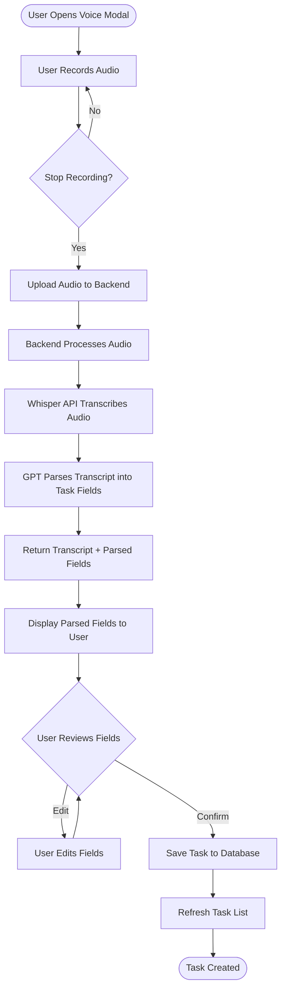

# Task Creation Flow

```mermaid
flowchart TD
    Start([User Opens Voice Modal]) --> Record[User Records Audio]
    Record --> Stop{Stop Recording?}
    Stop -->|No| Record
    Stop -->|Yes| Upload[Upload Audio to Backend]
    Upload --> Backend[Backend Processes Audio]
    Backend --> Transcribe[Whisper API Transcribes Audio]
    Transcribe --> Parse[GPT Parses Transcript into Task Fields]
    Parse --> Return[Return Transcript + Parsed Fields]
    Return --> Display[Display Parsed Fields to User]
    Display --> Review{User Reviews Fields}
    Review -->|Edit| Edit[User Edits Fields]
    Edit --> Review
    Review -->|Confirm| Save[Save Task to Database]
    Save --> Refresh[Refresh Task List]
    Refresh --> End([Task Created])
```
